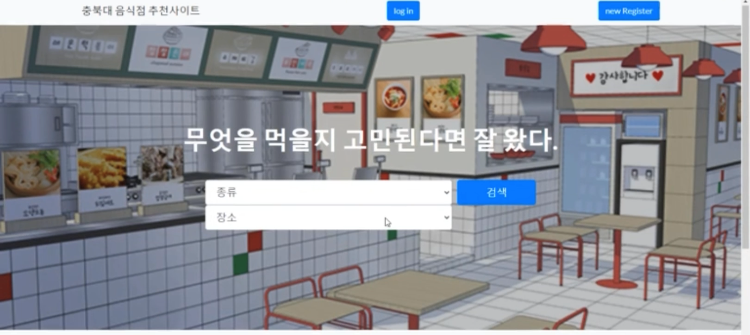

# 충북대 음식점 추천 사이트

   
  
   

## 프로젝트 소개
### 프로젝트 동기

프로젝트 동기
충북대 학생으로서 무엇을 먹을지 고민하는 사람들이 있다는 것을 깨닫고 음식의 종류(한식, 중식, 일식, 분식), 위치(정문, 중문, 서문)뿐만 아니라 자신의 의견도 표현할 수 있도록 하는 웹 사이트를 만들어 보자는 생각으로 개발하게 되었습니다.

###  프로젝트 목적
- 사용자는 위치와 음식의 종류에 따라 음식점을 추천받아 고민하는 시간 절약
- 평점과 댓글을 보며 사용자끼리의 의사소통

GIF Images

 

## 기술 스택

| Html | Css | BootStrap | Jsp   |  MySql   | Apache Tomcat | 
| :--------: | :--------: | :------: | :-----: | :-----: | :-----: |
|   ![html]    |   ![css]    | ![bootstrap] | ![jsp] | ![mysql] | ![tomcat] |

 

## 구현 기능

### 위치별로 음식점 추천
#### 충북대학교 정문, 중문, 서문, 후문별로 구분하여 사용자가 원하는 위치에 음식점을 추천받을 수 있다.

### 종류별로 음식점 추천 
#### 한식, 중식, 양식, 분식별로 구분하여 사용자가 원하는 음식의 종류로 음식점을 추천받을 수 있다.

### 평점별로 음식점 추천
####  음식점별로 평점을 주어 자신의 의견을 표현하고 다른 사용자의 의견도 볼 수 있다.

### 평점, 댓글 기능 
#### 평점과 댓글 기능을 사용하여 자신의 의견을 표현과 동시에 다른 사용자의 의견도 볼 수 있다.
### 음식점 등록 신청 기능
#### 음식점 업주 입장에서 자신의 음식점을 등록할 수 있다.

 

## 배운 점 & 아쉬운 점
- Jsp와 Myspl를 이용하여 웹 사이트의 기능들을 하나씩 개발해가면서 DB와 연동하는 법을 익히게 되었고
웹사이트에 기능들을 하나씩 경험해 볼수 있었던 프로젝트라고 생각합니다.
- 처음 개인적으로 JSP를 이용하여 만든 웹페이지라 UI가 좋지 못한 것 같기 때문에 Html, Css를 조금 더 알아야 겠다는 생각이 들었고
웹사이트가 아니고 애플리케이션으로 만들었다면 훨씬더 사용성과 접근성이 높았을 꺼 같다는 생각에 아쉬웠습니다.

 

<!-- Stack Icon Refernces -->

[html]: /readme_img/html.svg
[css]: /readme_img/css.svg
[bootstrap]: /readme_img/bootstrap.svg
[jsp]: /readme_img/jsp.svg
[mysql]: /readme_img/mysql.svg
[tomcat]: /readme_img/tomcat.svg
